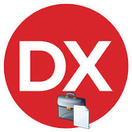

# Delphi-Collection-Utils
My Own Delphi-Collection ( Utils ) 

**Authors:**  *WalWalWalides*
------

## Contains

| File | Contents | 
| --- | --- |
| .gitignore | Git ignores the Files in this File |
|[DefineStringsList](https://github.com/walwalwalides/Delphi-Collection-Utils/tree/master/DefineStringlist)| Define Stringslist and add new methods.|
| README.md | The Readme for this Project|

------

# If You Want To Donate!

